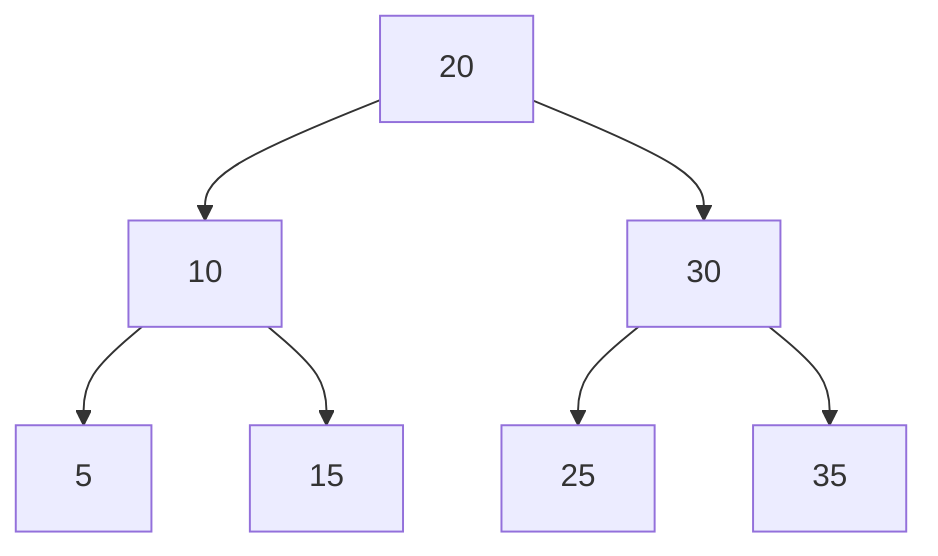
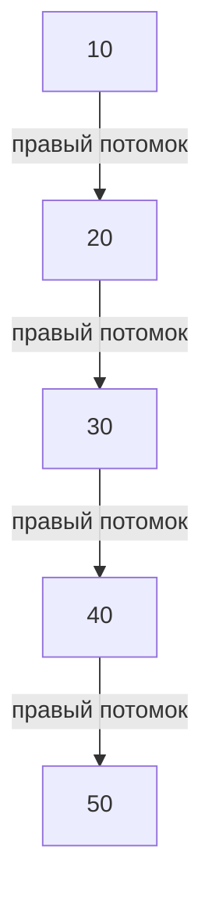

# Set, Comparable и Comparator

Оператор получил список номеров заказов, в котором встречаются повторы:

```java
long[] orderIds = {30L, 10L, 30L, 20L, 10L};
```

Нужно собрать уникальные номера заказов. Можно использовать обычный список и перед каждым добавлением проверять, нет ли в нём такого номера:

```java
List<Long> uniqueIds = new ArrayList<>();

for (long id : orderIds) {
    if (!uniqueIds.contains(id)) {
        uniqueIds.add(id);
    }
}

System.out.println(uniqueIds); // [30, 10, 20]
```

Это работает, но `ArrayList.contains()` ищет элемент перебором, каждый раз перебирая все заново. Чем больше список, тем больше проверок потребуется при следующем добавлении. Если все номера разные, мы последовательно проверим список с длиной `0`, `1`, `2` и так далее. В итоге обработка всего набора может потребовать `O(n²)` действий.

Кроме того, за отсутствие повторов теперь отвечает наш код: если где-то забыть проверку, дубликат попадёт в список.

Для таких задач есть `Set`.

> **`Set` — коллекция уникальных элементов.** При попытке добавить уже существующий элемент второй экземпляр в коллекции не появляется.

Но здесь возникают два отдельных вопроса:

* Как коллекция понимает, что элемент уже существует?
* В каком порядке она позволяет обходить элементы?

Ответ зависит от реализации.

***

## `HashSet`

Начнём с ситуации, когда нужен быстрый поиск и отсутствие повторов, а **порядок не важен**:

```java
Set<Long> uniqueIds = new HashSet<>();

for (long id : orderIds) {
    uniqueIds.add(id);
}

System.out.println(uniqueIds.size());         // 3
System.out.println(uniqueIds.contains(10L)); // true
```

Перед `add()` не требуется отдельно вызывать `contains()`: проверку наличия выполняет сама коллекция. При этом `add()` возвращает `boolean` — можно узнать, произошло ли добавление или это был дубль, и `HashSet` его пропустил:

```java
Set<Long> ids = new HashSet<>();

System.out.println(ids.add(10L)); // true
System.out.println(ids.add(20L)); // true
System.out.println(ids.add(10L)); // false

System.out.println(ids.size()); // 2
```

`false` означает, что такой элемент уже присутствовал и содержимое `Set` не изменилось.

***

### Как устроен `HashSet`

Мы уже знаем структуру, которая умеет быстро находить ключи и не хранит два одинаковых ключа, — `HashMap`. Если значения нам не нужны, можно использовать только её ключи. Именно на этом построен `HashSet`: **внутри него находится `HashMap`, а элементы множества хранятся как ключи.**

Упрощённо содержимое такого `Set`:

```java
Set<Long> ids = new HashSet<>();

ids.add(30L);
ids.add(10L);
ids.add(20L);
```

можно представить как внутреннюю Map:

| Ключ — элемент `Set` | Служебное значение |
| -------------------- | ------------------ |
| `30L`                | `new Object()`     |
| `10L`                | `new Object()`     |
| `20L`                | `new Object()`     |

`new Object()` — объект-заглушка. Чтобы не создавать каждый раз такую заглушку заново, в `HashSet` она вынесена в константу:&#x20;

```
static final Object PRESENT = new Object();
```

В OpenJDK метод `add()` реализован так:

```java
public boolean add(E element) {
    return map.put(element, PRESENT) == null;
}
```

Здесь `E` обозначает тип элемента множества. Если ключа ещё не было, `put()` возвращает `null`, поэтому результат `add()` — `true`. Если ключ уже был, `put()` возвращает прежнее значение, а `add()` — `false`.

***

### Как определяется уникальность

Добавление элемента использует уже знакомый механизм `HashMap`:

1. По `hashCode()` элемента вычисляется хеш и определяется бакет.
2. Внутри бакета проверяются подходящие записи.
3. При совпадении хеша проверяется равенство ключей по `equals()`.
4. Если равный ключ найден, новый элемент не добавляется.

**Одинаковые хеши сами по себе не делают элементы одинаковыми.** Разные объекты могут попасть в один бакет и продолжать храниться отдельно.

Если же класс не переопределяет `equals()` и наследует его от `Object`, используется сравнение по ссылке — два отдельных объекта обычно будут считаться разными, даже если значения всех их полей совпадают.

***

### Коллизии и скорость работы

Так как внутри используется `HashMap`, сохраняются её механизмы:

* массив бакетов;
* связанные узлы при коллизиях;
* преобразование длинных цепочек в деревья при выполнении условий;
* расширение таблицы с учётом коэффициента нагрузки.

Повторно изучать их устройство не требуется: **элемент `HashSet` занимает место ключа `HashMap`**.

При хорошем распределении хешей после выбора бакета нужно проверить небольшое количество записей. Поэтому `contains()` и `remove()` в среднем работают за `O(1)`, а `add()` — за амортизированное `O(1)` (то есть `O(1)` в среднем) — отдельная вставка может вызвать дорогое расширение, но его стоимость распределяется между многими добавлениями.

Преобразование бакета в дерево не меняет правило уникальности `HashSet`: оно по-прежнему связано с хешированием и равенством элементов.

***

### Порядок и изменяемые элементы

`HashSet` **не гарантирует порядок**. На конкретных данных вывод может случайно быть отсортированным или совпадать с порядком вставки, но полагаться на это нельзя.

Также сохраняется проблема изменяемого ключа из предыдущей главы. Если изменить поле элемента, участвующее в `equals()` и `hashCode()`, последующие `contains()` или `remove()` могут его не найти.

Это тот же механизм: объект остался в коллекции, но новый поиск использует изменившиеся данные.


Можно ли "сломать" `HashSet` — добиться того, чтобы один и тот же объект оказался в нем дважды?


<details>

<summary>Ответ</summary>

Да — например, у класса `OrderKey` сделать изменяемое поле `id`. Методы `equals()` и `hashCode()` корректно реализованы и используют только это поле. Можно: добавить объект, изменить его `id`, затем повторно добавить тот же объект.

```java
OrderKey key = new OrderKey(10L);
Set<OrderKey> keys = new HashSet<>();

keys.add(key);

key.setId(26L);

System.out.println(keys.add(key)); // true
System.out.println(keys.size());   // 2
```

При первой вставке внутренняя `HashMap` сохранила хеш, рассчитанный для `id = 10`.

После изменения поля объект остался в коллекции, но его текущий `hashCode()` уже соответствует `id = 26`. Повторный `add()` использует новый хеш и не находит прежнюю запись — даже если индекс бакета совпал, сохраненные хеши отличаются.

Поэтому создаётся ещё одна запись, ссылающаяся **на тот же объект**.

Контракт между `equals()` и `hashCode()` здесь не нарушен: они по-прежнему согласованы. Нарушено другое условие — **данные, определяющие равенство элемента, изменились, пока он находился в `Set`**.

</details>

***

## `LinkedHashSet`

Теперь оператору нужны уникальные номера **в порядке их появления**. Входные данные прежние:

```java
long[] orderIds = {30L, 10L, 30L, 20L, 10L};
```

Ожидаемый результат — `[30, 10, 20]`. Для этого подходит `LinkedHashSet`:

```java
Set<Long> uniqueIds = new LinkedHashSet<>();

for (long id : orderIds) {
    uniqueIds.add(id);
}

System.out.println(uniqueIds); // [30, 10, 20]
```

***

### Как сохраняется порядок

`LinkedHashSet` использует `LinkedHashMap`: элементы хранятся как ключи, а записи дополнительно соединены общим двусвязным списком. У каждой записи есть связь с предыдущей и следующей записью в порядке добавления.

Здесь, как и в `LinkedHashMap`, важно различать:

* связи внутри бакета — для обработки коллизий;
* общий список записей — для сохранения порядка всех элементов.

**Правило уникальности остаётся таким же, как в `HashSet`: `hashCode()` и `equals()`.** Дополнительные связи отвечают за порядок, а не за определение равенства.

***

### Повторное добавление

Обычный `add()` существующего элемента не перемещает его в конец:

```java
Set<Long> ids = new LinkedHashSet<>();

ids.add(30L);
ids.add(10L);
ids.add(20L);

ids.add(30L);
ids.contains(10L);

System.out.println(ids); // [30, 10, 20]
```

Вызов `contains()` тоже не меняет порядок. **У `LinkedHashSet` нет переключателя в режим порядка доступа, аналогичного конструктору `LinkedHashMap`.** Если удалить элемент и добавить заново, это уже новая вставка:

```java
ids.remove(30L);
ids.add(30L);

System.out.println(ids); // [10, 20, 30]
```

За дополнительные связи требуется память и работа по их поддержанию, но основные операции при хорошем хешировании сохраняют близкую к `HashSet` производительность.

***

## Основные методы `Set`

<table data-search="false"><thead><tr><th>Метод</th><th>Назначение</th></tr></thead><tbody><tr><td><code>add(element)</code></td><td>Добавить элемент. Возвращает <code>true</code>, если он появился в множестве</td></tr><tr><td><code>contains(element)</code></td><td>Проверить наличие элемента</td></tr><tr><td><code>remove(element)</code></td><td>Удалить элемент. Вернуть <code>true</code>, если он был удалён</td></tr><tr><td><code>size()</code></td><td>Получить количество элементов</td></tr><tr><td><code>isEmpty()</code></td><td>Проверить, пусто ли множество</td></tr><tr><td><code>clear()</code></td><td>Удалить все элементы</td></tr><tr><td><code>addAll(collection)</code></td><td>Добавить элементы другой коллекции</td></tr></tbody></table>

У интерфейса `Set` нет метода `get(index)`. Даже сохранение порядка в `LinkedHashSet` не превращает его в список с доступом по индексу.

Для обычного обхода подходит `for-each`:

```java
for (Long id : uniqueIds) {
    System.out.println("Заказ № " + id);
}
```

***

#### Пример: найти повторяющиеся номера

Теперь требуется узнать, **какие номера встретились больше одного раза**.

Будем хранить два множества:

* `seen` — номера, которые уже встречались;
* `duplicates` — номера, для которых встретился повтор.

```java
long[] orderIds = {30L, 10L, 30L, 20L, 10L, 30L};

Set<Long> seen = new HashSet<>();
Set<Long> duplicates = new LinkedHashSet<>();

for (long id : orderIds) {
    if (seen.add(id) == false) { // уже есть такой элемент
        duplicates.add(id);
    }
}

System.out.println(duplicates); // [30, 10]
```

Если номер встретился впервые, `add()` возвращает `true`. Если он уже был, возвращается `false`, и мы добавляем номер в `duplicates`.

Третье появление `30L` не создаст ещё один элемент в `duplicates`: это тоже множество.

`LinkedHashSet` здесь сохраняет порядок, в котором мы обнаружили повторы.

***

## `TreeSet`

Допустим, номера должны выводиться по возрастанию независимо от порядка добавления:

```java
Set<Long> ids = new TreeSet<>();

ids.add(30L);
ids.add(10L);
ids.add(20L);
ids.add(10L);

System.out.println(ids); // [10, 20, 30]
```

`TreeSet` поддерживает сразу два свойства:

* отсутствие повторов;
* порядок, определяемый сравнением элементов.

Но его устройство отличается от хеш-таблицы.

***

Обычный `TreeSet` использует `TreeMap`. Элементы множества становятся её ключами, а сама карта организована как **красно-чёрное дерево**.

Сначала разберём идею дерева поиска, временно оставив балансировку в стороне.

У узла есть элемент и ссылки на левое и правое поддеревья. Для чисел при порядке по возрастанию:

* слева находятся меньшие числа;
* справа — большие.

Одна из возможных форм такого дерева:



Чтобы найти `25`, выполняем несколько сравнений:

1. `25 > 20` — переходим вправо.
2. `25 < 30` — переходим влево.
3. `25 == 25` — элемент найден.

Мы не проверяли `5`, `10`, `15` и `35`: расположение узлов позволило исключить их из поиска.

**При добавлении выполняется похожий проход.** Если найден равный по сравнению элемент, новое значение не добавляется. Если поиск дошёл до отсутствующей ветви, там может появиться новый узел.

***

### Зачем нужна балансировка

Если обычное дерево поиска заполнять возрастающими числами, без балансировки у каждого узла может оказаться только правый потомок. Тогда поиск последнего элемента снова потребует пройти все узлы — получится `O(n)`.



Чтобы найти `50`, придётся проверить все пять узлов. Дерево превратилось в цепочку, поэтому поиск последнего элемента занимает `O(n)`.

Чтобы этого избежать, `TreeMap` поддерживает свойства красно-чёрного дерева.

У каждого узла хранится признак цвета — красный или чёрный. Цвет не относится к данным заказа: это служебная информация для балансировки.

Основные правила:

* корень чёрный;
* у красного узла не может быть красного ребёнка;
* все пути от узла до потомков содержат одинаковое число чёрных узлов;
* отсутствующие потомки при проверке этих правил считаются чёрными.

Эти ограничения не позволяют одной ветви стать сильно длиннее остальных. После вставки и удаления дерево при необходимости меняет цвета и выполняет **повороты** — локальные перестройки связей, сохраняющие порядок элементов.

В результате высота дерева растёт логарифмически с количеством узлов — `add()`, `contains()` и `remove()` имеют сложность `O(log n)` по числу операций сравнения. Стоимость самого сравнения элементов тоже имеет значение.

***

При обходе по возрастанию сначала посещается левое поддерево, затем текущий элемент, затем правое поддерево. Для сбалансированного дерева выше получим:

`5, 10, 15, 20, 25, 30, 35`.

Поэтому `TreeSet` не сортирует все элементы заново перед каждым выводом. Порядок уже заложен в структуре дерева.

Однако с числами всё понятно: `10` меньше `20`. А как сравнить два объекта `Order`? По номеру, времени доставки или имени курьера?

***

## `Comparable`

> **`Comparable<T>` задаёт естественный порядок объектов класса** — правило сравнения, предусмотренное самим классом.

Его основной метод:

```java
int compareTo(T other);
```

Вызов `first.compareTo(second)` сравнивает объект `first` с объектом `second`.

<table><thead><tr><th width="349.9140625">Результат</th><th>Смысл</th></tr></thead><tbody><tr><td>Любое отрицательное число</td><td>Первый объект меньше второго</td></tr><tr><td><code>0</code></td><td>Объекты равны</td></tr><tr><td>Любое положительное число</td><td>Первый объект больше второго</td></tr></tbody></table>

Например, сделаем еестественный порядок (порядок по умолчанию) для заказов по `id`. Равенство через `equals()` тоже определим по `id`.

Кроме `id`, добавим плановое время доставки в минутах и имя назначенного курьера. Имя может быть `null`, если курьер ещё не назначен.

```java
@AllArgsConstructor
@Getter
final class Order implements Comparable<Order> {

    private final long id;
    private final int deliveryMinutes;
    private final String courierName;

    @Override
    public int compareTo(Order other) {
        return Long.compare(id, other.id);
    }

    @Override
    public boolean equals(Object obj) {
        if (this == obj) {
            return true;
        }
        if (!(obj instanceof Order)) {
            return false;
        }

        Order other = (Order) obj;
        return id == other.id;
    }

    @Override
    public int hashCode() {
        return Long.hashCode(id);
    }

    @Override
    public String toString() {
        return "#" + id;
    }
}
```

Запись `implements Comparable<Order>` означает: **класс умеет сравнивать себя с другим `Order`**.

В `compareTo()` вызывается `Long.compare()`: он сравнивает два значения `long` и возвращает результат нужного знака.

```java
Order order30 = new Order(30L, 20, "Олег");
Order order10 = new Order(10L, 40, null);
Order order20 = new Order(20L, 20, "Анна");
```

| Объект    | `id` | Время доставки | Курьер      |
| --------- | ---: | -------------: | ----------- |
| `order30` |   30 |       20 минут | Олег        |
| `order10` |   10 |       40 минут | Не назначен |
| `order20` |   20 |       20 минут | Анна        |

Теперь `TreeSet` может использовать естественный порядок:

```java
TreeSet<Order> ordersById = new TreeSet<>();

ordersById.add(order30);
ordersById.add(order10);
ordersById.add(order20);

System.out.println(ordersById); // [#10, #20, #30]
```

При поиске места для очередного заказа дерево использует `compareTo()`.

Если класс не реализует `Comparable` и правило сравнения не передано отдельно, обычный `TreeSet` не сможет упорядочивать его объекты: **при добавлении возникнет `ClassCastException`**.

***

Иногда пишут:

```java
return first - second;
```

Но разность двух допустимых `int` может выйти за диапазон `int`. `int` хранит числа от `-2 147 483 648` до `2 147 483 647`. Оба сравниваемых значения могут помещаться в этот диапазон, а их разность — уже нет:

```java
int first = 2_000_000_000;
int second = -1_000_000_000;

int result = first - second;

System.out.println(result); // -1294967296
```

Математически результат равен `3 000 000 000`, но это больше максимального `int`. Происходит **переполнение**: Java не выбрасывает исключение, а сохраняет результат в пределах допустимой памяти — 32 бит. Из-за этого получаем неожиданное число.

Если вернуть его из компаратора, он сообщит, что `first` должен идти **раньше** `second`, хотя при сортировке по возрастанию должно быть наоборот.

Поэтому вместо вычитания используют:

```java
return Integer.compare(first, second); // 1
```

`Integer.compare()` определяет, какое значение меньше, равно или больше, без вычисления потенциально переполняющейся разности. Для `long` аналогично используют `Long.compare()`.

***

## `Comparator`

Естественный порядок по `id` подходит не для всех случаев. Например, оператору нужно сначала видеть заказы, которые доставят в ближайшее время. Менять из-за этого `Order.compareTo()` неудобно: другие части приложения могут рассчитывать на порядок по идентификатору.

> `Comparator<T>` — отдельный объект, который задаёт правило сравнения двух объектов типа `T`.

Его основной метод принимает уже **два аргумента**:

```java
int compare(T first, T second);
```

Правила результата те же: отрицательное число, ноль или положительное число. Напишем обычный класс:

```java
final class OrderByDeliveryTimeComparator implements Comparator<Order> {

    @Override
    public int compare(Order first, Order second) {
        return Integer.compare(
                first.getDeliveryMinutes(),
                second.getDeliveryMinutes()
        );
    }
}
```

Теперь правило существует отдельно от `Order`.

Его можно передать, например, методу сортировки списка:

```java
List<Order> orders = new ArrayList<>(ordersById);
orders.sort(new OrderByDeliveryTimeComparator());
System.out.println(orders); // [#20, #30, #10]
```

Конструктор `ArrayList<>(ordersById)` скопировал элементы множества в список. Затем `sort()` изменил порядок элементов этого списка.

Сначала идут заказы со временем `20` минут, затем — со временем `40` минут. Заказы № 20 и № 30 равны по выбранному критерию. `List.sort()` сохраняет относительный порядок таких элементов, поэтому № 20 остаётся перед № 30.

Компаратор можно передать и в конструктор `TreeSet`. Тогда дерево будет использовать **его `compare()` вместо естественного `compareTo()`**. Автоматического дополнительного сравнения по `id` не произойдёт.

***

### Когда что использовать

|                        | `Comparable`                                           | `Comparator`                                                                         |
| ---------------------- | ------------------------------------------------------ | ------------------------------------------------------------------------------------ |
| Где находится правило? | В самом классе                                         | В отдельном объекте                                                                  |
| Основной вызов         | `first.compareTo(second)`                              | `comparator.compare(first, second)`                                                  |
| Что задаёт             | Естественный порядок класса (порядок **по умолчанию**) | Порядок для конкретной задачи (указываем **явно**)                                   |
| Пример                 | Заказы по умолчанию по `id`                            | В одном конкретном случае по умолчанию не подходит, нужны заказы по времени доставки |

`Comparable` подходит, когда у типа есть понятный основной порядок. Если такого порядка нет, не обязательно придумывать его только ради реализации интерфейса.

`Comparator` удобен, когда нужны разные варианты сортировки или нельзя изменить исходный класс (например, он из внешней библиотеки). Оба подхода могут использоваться вместе: естественный порядок — по умолчанию, компаратор — для отдельного сценария.

***

### Методы компараторов

Писать отдельный класс для каждого простого правила было бы слишком долго. В `Comparator` есть методы, которые позволяют быстро создавать и объединять правила сравнения.

Мы уже разобрали `compare()` — у него есть сокращенный вариант.

***

#### `Comparator.comparing()`

Наш компаратор делает две вещи:

1. Получает время доставки каждого заказа.
2. Сравнивает полученные числа.

Эту последовательность можно записать так:

```java
Comparator<Order> byTime = Comparator.comparing(Order::getDeliveryMinutes);
```

`Order::getDeliveryMinutes` — **ссылка на метод**. Здесь её смысл: «для переданного заказа вызвать `getDeliveryMinutes()`». Так мы передаём способ получить значение, которое потребуется при сравнении.

`comparing()` создаёт компаратор, который получает указанное значение у обоих объектов и сравнивает значения признака уже способом по умолчанию (`getDeliveryMinutes()` возвращает числа — для них компаратор уже понимает, что можно сортировать по возрастанию).

Использование:

```java
orders.sort(byTime);
```

Само создание компаратора ещё ничего не сортирует. Это только подготовленное правило.

Для примитивных типов данных есть специализированные варианты:

```java
Comparator<Order> byTime = Comparator.comparingInt(Order::getDeliveryMinutes);
```

Аналогично существуют `comparingLong()` и `comparingDouble()`.

***

#### `thenComparing()`

У заказов № 20 и № 30 одинаковое время доставки. Допустим, при совпадении времени первым должен идти заказ с меньшим `id`. Явная логика выглядела бы так:

```java
int result = Integer.compare(
        first.getDeliveryMinutes(),
        second.getDeliveryMinutes()
);

if (result != 0) {
    return result;
}

return Long.compare(first.getId(), second.getId());
```

Сначала сравниваем время. Только если оно одинаковое, обращаемся ко второму признаку.

Та же логика через готовые методы:

```java
Comparator<Order> byTimeThenId = Comparator.comparing(Order::getDeliveryMinutes)
    .thenComparing(Order::getId);
```

**`thenComparing()` применяется только тогда, когда предыдущее сравнение вернуло 0 (то есть по предыдущему полю объекты равны).**

Для наших заказов получится:

| Место | Заказ | Причина                     |
| ----: | ----- | --------------------------- |
|     1 | № 20  | 20 минут, меньший `id`      |
|     2 | № 30  | Тоже 20 минут, больший `id` |
|     3 | № 10  | 40 минут                    |

Если совпадают все критерии цепочки, итоговый результат сравнения — `0`.

***

#### `reversed()`

`reversed()` создаёт компаратор с противоположным порядком. Например, чтобы сначала показывать заказы с большим временем доставки:

```java
Comparator<Order> byTimeDescending = byTime.reversed();
```

Но при цепочке критериев важно, **к какому именно компаратору применён `reversed()`**. Вариант 1 — развернуть всю цепочку:

```java
Comparator<Order> bothDescending =
        Comparator.comparing(Order::getDeliveryMinutes)
                .thenComparing(Order::getId)
                .reversed();
```

Теперь и время, и `id` идут по убыванию.

Вариант 2 — развернуть **только первый критерий**, затем добавить второй:

```java
Comparator<Order> timeDescendingIdAscending =
        Comparator.comparing(Order::getDeliveryMinutes)
                .reversed()
                .thenComparing(Order::getId);
```

Теперь время идёт по убыванию, а при одинаковом времени `id` — по возрастанию.

| Правило               | Порядок заказов  |
| --------------------- | ---------------- |
| Время ↑, затем `id` ↑ | № 20, № 30, № 10 |
| Время ↓, затем `id` ↓ | № 10, № 30, № 20 |
| Время ↓, затем `id` ↑ | № 10, № 20, № 30 |

Эти методы возвращают новые компараторы и не изменяют существующие. Поэтому вызов `byTime.reversed()` не изменит правило, сохранённое в `byTime`.

***

## Как `TreeSet` определяет уникальность

| Реализация                | Как при добавлении, поиске и удалении определяется совпадение |
| ------------------------- | ------------------------------------------------------------- |
| `HashSet`                 | Хеширование и равенство элементов                             |
| `LinkedHashSet`           | Хеширование и равенство элементов                             |
| `TreeSet` без компаратора | Результат `compareTo()` равен `0`                             |
| `TreeSet` с компаратором  | Результат `compare()` равен `0`                               |

В `TreeSet` сравнение отвечает **и за направление поиска, и за решение, найден ли существующий элемент**. После результата `0` отдельная проверка элементов через `equals()` в этих операциях не выполняется.

Это означает, что правило, подходящее для сортировки списка, может оказаться неподходящим для `TreeSet`.

***

#### `equals()` возвращает `false`, а сравнение — `0`

Наши заказы № 30 и № 20 имеют разные идентификаторы, но одинаковое время доставки:

```java
System.out.println(order30.equals(order20));   // false
System.out.println(byTime.compare(order30, order20)); // 0
```

Теперь используем сравнение только по времени в `TreeSet`:

```java
TreeSet<Order> byTimeSet = new TreeSet<>(byTime);

System.out.println(byTimeSet.add(order30)); // true
System.out.println(byTimeSet.add(order20)); // false

System.out.println(byTimeSet.size()); // 1
System.out.println(byTimeSet);        // [#30]
```

При добавлении № 20 дерево обнаружило элемент с тем же временем и получило результат сравнения `0`. Поэтому второй заказ не был добавлен.

Это влияет не только на `add()`:

```java
System.out.println(byTimeSet.contains(order20)); // true
System.out.println(byTimeSet.remove(order20));   // true

System.out.println(byTimeSet.size()); // 0
```

Хотя объект `order20` не был сохранён в `TreeSet`, поиск нашёл заказ № 30 и по правилам сравнения посчитал их одинаковыми. По той же причине удаление убрало № 30.

***

#### Обратная ситуация: `equals()` возвращает `true`, а сравнение — не `0`

Представим два объекта одного заказа с разными оценками времени:

```java
Order first = new Order(30L, 20, "Олег");
Order second = new Order(30L, 40, "Олег");

System.out.println(first.equals(second)); // true
```

По нашей модели это один заказ: идентификатор совпадает. Но компаратор сначала сравнивает время:

```java
System.out.println(byTimeThenId.compare(first, second)); // отрицательное число
```

Первый критерий уже различается. До сравнения `id` дело не дойдёт.

```java
Set<Order> orders = new TreeSet<>(byTimeThenId);

System.out.println(orders.add(first));  // true
System.out.println(orders.add(second)); // true
System.out.println(orders.size());     // 2
```

Получились два элемента, хотя они равны по `equals()`.

> Оба рассмотренных случая нарушают общий контракт `Set` — согласно нему, дубликаты должно быть можно определить через `equals()`. Для корректного соблюдения этого контракта нужно, чтобы `comparator.compare(first, second)` и `first.equals(second)` **давали одинаковые результаты**.

Для согласованности нужны оба направления:

* равны по `equals()` ⇒ сравнение возвращает `0`;
* сравнение возвращает `0` ⇒ равны по `equals()`.

***

#### Изменение элементов внутри `TreeSet`

`TreeSet` тоже не отслеживает изменения полей объектов.

Если в другой, изменяемой версии `Order` поменять время доставки, а дерево построено по времени, элемент сам не переместится в новое место. Структура будет отражать прежнее сравнение, а последующие операции — использовать новые данные. Это может нарушить порядок обхода и поиск.

Поэтому поля, используемые для сравнения в дереве, должны оставаться стабильными, пока объект находится в нём. Если изменение необходимо, элемент сначала удаляют по старым данным, затем изменяют и добавляют заново.

При естественном порядке `TreeSet` не допускает `null`, но если указать компаратор, умеющий его сравнивать (например созданный через `nullsFirst()` или `nullsLast()`), тогда `null` хранить можно.

***

### Дополнительные возможности `TreeSet`

Можно искать ближайшие элементы:

```java
TreeSet<Long> ids = new TreeSet<>();

ids.add(10L);
ids.add(20L);
ids.add(30L);

System.out.println(ids.first());      // 10
System.out.println(ids.last());       // 30
System.out.println(ids.lower(20L));   // 10
System.out.println(ids.floor(20L));   // 20
System.out.println(ids.ceiling(25L)); // 30
System.out.println(ids.higher(20L));  // 30
```

* `lower(x)` — ближайший элемент строго меньше `x`.
* `floor(x)` — ближайший элемент меньше либо равный `x`.
* `ceiling(x)` — ближайший элемент больше либо равный `x`.
* `higher(x)` — ближайший элемент строго больше `x`.

Если подходящего соседа нет, эти методы возвращают `null`. «Меньше» и «больше» здесь определяются выбранным порядком сравнения.

Переменная имеет тип `TreeSet`, потому что в обычном интерфейсе `Set` этих методов нет.

***


Что выведет код?

```java
Set<String> ids = new TreeSet<>(String.CASE_INSENSITIVE_ORDER);

System.out.println("ORDER-10".equals("order-10"));

System.out.println(ids.add("ORDER-10"));
System.out.println(ids.add("order-10"));

System.out.println(ids.contains("Order-10"));
System.out.println(ids.remove("oRdEr-10"));

System.out.println(ids.size());
```

`String.CASE_INSENSITIVE_ORDER` — готовый компаратор строк без учёта регистра.


<details>

<summary>Ответ</summary>

```
false
true
false
true
true
0
```

По шагам:

1. Обычный `String.equals()` учитывает регистр, поэтому строки не равны.
2. Первый номер добавляется.
3. При втором добавлении компаратор игнорирует регистр и возвращает `0`. Новый элемент не появляется.
4. `contains()` использует то же сравнение, поэтому находит сохранённый номер.
5. `remove()` тоже находит его независимо от регистра и удаляет.
6. Множество становится пустым.

</details>

***

### Вопросы


**Опишите внутреннее устройство и принципы работы `HashSet`, `LinkedHashSet` и `TreeSet`.**

`HashSet` хранит элементы как ключи внутренней `HashMap`. Поиск использует хеширование и равенство элементов, порядок не гарантируется.

`LinkedHashSet` использует `LinkedHashMap`: к хеш-таблице добавлен общий двусвязный список записей, сохраняющий порядок вставки.

`TreeSet` использует `TreeMap` на основе красно-чёрного дерева. Элементы размещаются и ищутся по результату сравнения.

Основные операции хеш-реализаций при хорошем хешировании имеют среднюю, а вставки — амортизированную стоимость `O(1)`; у `TreeSet` основные операции — `O(log n)`.



**В чем разница между интерфейсами `Comparable` и `Comparator`? Когда следует использовать каждый из них?**

`Comparable` — интерфейс, который реализуется самим классом и задаёт его естественный порядок по умолчанию; метод — `compareTo(other)`. `Comparator` — отдельный объект, задаёт отдельное правило сортировки; метод — `compare(first, second)`. В обоих случаях знак результата определяет порядок, а `0` означает равенство.

`Comparable` используют для основного порядка объектов класса. `Comparator` — для альтернативных порядков, отдельных сценариев сортировки или классов, которые нельзя изменить.

Явно переданный в `TreeSet` компаратор переопределяет порядок по умолчанию.



**Методы компараторов — `Comparator.comparing()`, `thenComparing()`, `reversed()`, `nullsFirst`, `nullsLast`.**

`comparing()` создаёт сравнение по указанному полю или выражению.

`thenComparing()` добавляет дополнительное правило сортировки, которое применяется если по предыдущему правилу объекты оказались равны.&#x20;

`reversed()` разворачивает порядок всего компаратора, к которому вызван.&#x20;

`nullsFirst()` и `nullsLast()` задают положение `null` — в начале или в конце — а остальные значения продолжают сравниваться по заданным правилам.

Все эти методы создают правила сравнения, но не сортируют ничего сами по себе — сортировку выполняет коллекция или соответствующий метод.



**Как обеспечивается уникальность элементов в каждой из реализаций `Set`?**

В `HashSet` и `LinkedHashSet` поиск существующего элемента использует хеширование и `equals()`.&#x20;

В `TreeSet` совпадением считается результат `compareTo()` или `compare()`, равный `0`. Повторный `add()` такого элемента возвращает `false` и не заменяет сохранённый объект.



**Как `TreeSet` поддерживает элементы в отсортированном порядке?**

Элементы расположены в дереве поиска упорядоченно, согласно выбранному сравнению. По результату сравнения поиск переходит в левое или правое поддерево либо находит совпадение. Красно-чёрная балансировка ограничивает высоту дерева, чтобы поиск был примерно одинаково быстрым для разных элементов. Дерево всегда обходится в порядке "сначала левое поддерево — потом сам узел — потом его правое поддерево", что в результате дает отсортированную последовательность.



**Какую роль играют `Comparable` и `Comparator`?**

Они задают правило, по которому `TreeSet` размещает элементы, ищет их и определяет совпадение. Без явно переданного компаратора используется естественный порядок через `Comparable`. При переданном компараторе используется его `compare()`.



**Что произойдёт, если `equals()` и `compareTo()` / `compare()` по-разному определяют равенство? Например, `equals()` возвращает `false`, а `compareTo()` / `compare()` — `0`?**

`TreeSet` будет следовать результату сравнения. При `equals() == false`, если в результате сравнения получили `0`, элементы с точки зрения `TreeSet` равны, и второй элемент не добавится; `contains()` и `remove()` также будут считать его совпадающим с сохранённым.

При `equals() == true`, если сравнение дало не `0`, элементы не равны с точки зрения `TreeSet`, и оба объекта могут попасть в множество.

Чтобы `TreeSet` соблюдал общий контракт `Set`, равенство по `equals()` и результат сравнения `0` должны совпадать в обе стороны.

