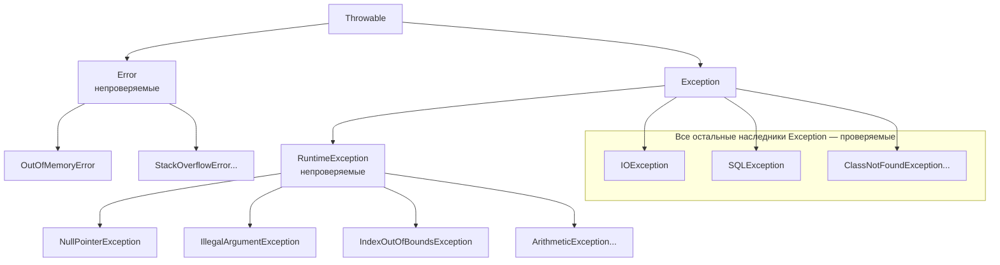
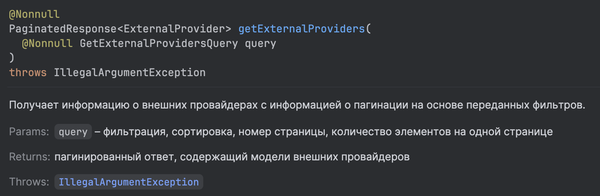

# Исключения

> **Исключение (exception)** — объект, который сообщает, что во время выполнения программы произошла проблема и обычное выполнение кода не может продолжаться как задумано.

Например:

```java
int result = 10 / 0;
```

Во время выполнения Java создаст исключение `ArithmeticException`. Если его никто не обработает, выполнение текущего потока будет прервано.

***

## Иерархия исключений



Главный базовый класс — `Throwable`. От него идут две основные ветки: `Error` и `Exception`.

***

### `Error`

> `Error` — серьёзная проблема на уровне JVM или окружения, которую обычный код приложения чаще всего не должен пытаться исправлять.

#### `OutOfMemoryError`

Программе не хватает памяти:

```java
List<byte[]> data = new ArrayList<>();

while (true) {
    data.add(new byte[1_000_000]);
}
```

#### `StackOverflowError`

Например, бесконечная рекурсия:

```java
void test() {
    test();
}
```

Каждый вызов добавляется в стек вызовов, пока место не закончится.

Обычно не пишут:

```java
try {
    ...
} catch (OutOfMemoryError e) {
    ...
}
```

потому что `Error` — критическая ошибка, и внутри приложения нельзя что-то сделать, чтобы ее исправить. Обычно такие ошибки просто логируют, анализируют, почему именно закончилась память, исправляют и перезапускают приложение; пока оно запущено, внести правки невозможно.

***

### `Exception`

> `Exception` — проблемы, которые связаны с выполнением программы и которые приложение может обработать.

Примеры:

```
IOException
SQLException
IllegalArgumentException
NullPointerException
```

Внутри `Exception` есть разделение:

```
Exception
├── RuntimeException // unchecked
│     ├── NullPointerException
│     ├── IllegalArgumentException
│     ├── IndexOutOfBoundsException
│     └── ...
│
└── остальные Exception // Checked
      ├── IOException
      ├── SQLException
      ├── ClassNotFoundException
      └── ...
```

***

#### Checked и unchecked exceptions

Главная разница: checked **exception Java заставляет обработать или объявить через `throws`.** Для **unchecked exception** такого требования нет.

Checked — это наследники `Exception`, кроме `RuntimeException` и его наследников. Например:

```java
- IOException
- SQLException
- ClassNotFoundException
```

Представим метод чтения файла:

```java
void readFile() throws IOException {
    ...
}
```

Если вызываем его, нельзя просто проигнорировать возможный `IOException`. Нужно либо его обработать:

```java
try {
    readFile();
} catch (IOException e) {
    System.out.println("Не удалось прочитать файл");
}
```

либо передать ответственность по обработке выше:

```java
void processFile() throws IOException {
    readFile();
}
```

То есть checked exception заставляет разработчика явно решить, что делать, если ошибка произойдёт.

`RuntimeException` и его наследники — **unchecked exceptions**. Например:

```java
- NullPointerException
- IllegalArgumentException
- IndexOutOfBoundsException
- ArithmeticException
```

Например:

```java
String name = null;
name.toUpperCase();
```

Получим `NullPointerException`. Но в отличие от проверяемых исключений, Java не заставляет писать:

```java
try {
    name.toUpperCase();
} catch (NullPointerException e) {
    ...
}
```

или `throws NullPointerException`. Иначе нам пришлось бы писать обязательную обработку каждый раз, когда мы вызываем любые методы любых объектов (объект может быть `null` ⇒ `NullPointerException`), берем элемент любого массива по индексу (индекс может быть больше, чем элементов в массиве ⇒ `IndexOutOfBoundsException`), при любом делении (вдруг делим на `0` ⇒ `ArithmeticException`).

***

## `try` / `catch`

`try` позволяет выполнить код, в котором может возникнуть исключение. `catch` описывает, что делать с определённым исключением:

```java
try {
    int result = 10 / 0;
} catch (ArithmeticException e) {
    System.out.println("Нельзя делить на ноль");
}
```

```
try
 ↓
возникает ArithmeticException
 ↓
оставшаяся часть try пропускается
 ↓
ищется подходящий для этого исключения catch
 ↓
выполняется catch
```

Например:

```java
try {
    System.out.println("1");

    int result = 10 / 0;

    System.out.println("2");
} catch (ArithmeticException e) {
    System.out.println("3");
}

System.out.println("4");
```

Получим:

```
1
3
4
```

Строка `System.out.println("2")` уже не выполнится, потому что после возникновения исключения Java не выполняет оставшуюся часть `try`.

***

### Объект исключения в `catch`

```java
catch (ArithmeticException e)
```

`e` — объект возникшего исключения. Например, можно получить сообщение:

```java
catch (IllegalArgumentException e) {
    System.out.println(e.getMessage());
}
```

Если было:

```java
throw new IllegalArgumentException(
        "Возраст не может быть отрицательным"
);
```

то `e.getMessage()` вернёт `"Возраст не может быть отрицательным"`.

***

### `finally`

> `finally` — блок, который выполняется после `try`/`catch` независимо от того, возникло исключение или нет.

Например:

```java
try {
    System.out.println("Работаем");
} catch (Exception e) {
    System.out.println("Ошибка");
} finally {
    System.out.println("Завершение");
}
```

Если ошибки нет:

```
Работаем
Завершение
```

Если ошибка возникла и была перехвачена:

```
Ошибка
Завершение
```

Если в `try` есть `return`, например:

```java
int getValue() {
    try {
        return 10;
    } finally {
        System.out.println("end");
    }
}
```

то Java все равно выполнит `finally` перед возвращением результата — выведется `"end"`, и только после этого вернется `10`. Если return есть в catch — то же самое:

```java
int getValue() {
    try {
        throw new RuntimeException();
    } catch (RuntimeException e) {
        return 20;
    } finally {
        System.out.println("end");
    }
}
```

Сначала выведется `"end"`, потом вернется `20`.

`finally` обычно используют для действий, которые необходимо выполнить в любом случае. Например, закрыть какой-нибудь ресурс. Но в современной Java для ресурсов чаще используется `try-with-resources`.

***

#### Что если в `try` есть `throw`?

Например:

```java
void process() {
    try {
        throw new IllegalArgumentException();
    } finally {
        System.out.println("end");
    }
}
```

Происходит:

```
throw
 ↓
finally
 ↓
исключение передаётся дальше
```

Cначала выведется `"end"`, потом `IllegalArgumentException` продолжит распространяться по стеку вызовов — его получит код, вызвавший метод `process()`.

***

#### Что если `finally` сам содержит `return`?

Например:

```java
int getValue() {
    try {
        return 10;
    } finally {
        return 20;
    }
}
```

Получим `20` — `return` из `finally` **перезапишет** первоначальный `return 10`.

Поэтому **не стоит писать `return` внутри `finally`.** `finally` должен выполнять завершающие действия, а не менять результат работы метода.

***

#### Что если `finally` выбрасывает новое исключение?

Например:

```java
try {
    throw new IllegalArgumentException("Ошибка 1");
} finally {
    throw new RuntimeException("Ошибка 2");
}
```

Наружу уйдёт `RuntimeException: Ошибка 2`. Изначальный `IllegalArgumentException` будет перезаписан новым исключением из `finally`.

***

#### Когда `finally` все-таки не выполняется?

```java
try {
    System.out.println("try");
    System.exit(0);
} finally {
    System.out.println("finally");
}
```

`System.exit(0)` завершает JVM. Поэтому обычное выполнение программы прекращается и `finally` **не выполняется**.

То есть правило "`finally` выполняется всегда" не совсем точное — есть исключения:&#x20;

* `System.exit()`
* процесс JVM принудительно убит извне, например `kill -9`.
* сбой JVM
* выключение питания
* выполнение навсегда застряло внутри `try`, например, в бесконечном цикле — до `finally` просто никогда не дойдет

***

### Multi-catch

Иногда разные исключения нужно обработать одинаково. Например:

```java
try {
    ...
} catch (IOException e) {
    System.out.println("Ошибка обработки данных");
} catch (SQLException e) {
    System.out.println("Ошибка обработки данных");
}
```

Можно объединить исключения:

```java
try {
    ...
} catch (IOException | SQLException e) {
    System.out.println("Ошибка обработки данных");
}
```

Это называется **multi-catch**. Синтаксис:

```java
catch (ExceptionA | ExceptionB | ExceptionC e)
```

***

#### Нельзя писать родителя и наследника в одном multi-catch

Например:

```java
catch (Exception | IOException e) {
}
```

`IOException` уже является `Exception`. Если мы ловим `Exception`, то `IOException` туда и так входит. Поэтому такой multi-catch бессмыслен.

***

### Порядок `catch`

Допустим:

```
Exception
   ↑
IOException
   ↑
FileNotFoundException
```

Блоки должны идти **от конкретного исключения к более общему**:

```java
try {
    ...
} catch (FileNotFoundException e) {
    System.out.println("Файл не найден");
} catch (IOException e) {
    System.out.println("Другая ошибка ввода-вывода");
} catch (Exception e) {
    System.out.println("Другая ошибка");
}
```

Так нельзя:

```java
try {
    ...
} catch (Exception e) {
    ...
} catch (IOException e) {
    ...
}
```

Первый `catch (Exception e)` уже поймает не только сам `Exception`, но и любых его наследников, включая и `IOException`. Поэтому до второго блока выполнение никогда не сможет дойти.

Java не позволяет писать такой недостижимый `catch`.

***

## `throw`

> `throw` — команда, которая **прямо сейчас выбрасывает конкретный объект исключения, который мы укажем**.

Например:

```java
void register(int age) {
    if (age < 0) {
        throw new IllegalArgumentException("Возраст не может быть отрицательным!");
    }

    System.out.println("Пользователь успешно зарегистрирован");
}
```

`new IllegalArgumentException(...)` создаёт объект исключения, `throw` выбрасывает его. После `throw` обычное выполнение метода прекращается: если напишем `register(-10)`, строка `System.out.println("Пользователь зарегистрирован")` не выполнится.

***

## `throws`

> `throws` пишется в объявлении метода и сообщает: **этот метод может бросить указанное исключение**.

Например:

```java
void readFile() throws IOException {
    ...
}
```

Это не означает, что исключение обязательно произойдёт, но оно может возникнуть, и сам метод его не будет обрабатывать — оно попадет выше, в код, который вызвал этот метод. Вызывающий код сам должен решить, что делать:

```java
try {
    readFile();
} catch (IOException e) {
    System.out.println("Ошибка чтения");
}
```

или снова передать исключение выше:

```java
void process() throws IOException {
    readFile();
}
```

| `throw`                                         | `throws`                             |
| ----------------------------------------------- | ------------------------------------ |
| Используется **внутри** метода                  | Используется в **объявлении** метода |
| **Реально выбрасывает** исключение              | Сообщает о **возможных** исключениях |
| `throw new ...`                                 | `someMethod() throws ...`            |
| После него выполнение текущего кода прерывается | Сам по себе ничего не выбрасывает    |

***

### Можно объявить несколько исключений в `throws`

Например:

```java
void process() throws IOException, SQLException {
    ...
}
```

Это значит, что метод может передать наружу `IOException` или `SQLException`.

***

### Нужно ли писать `throws` для `RuntimeException`?

Java это требует только для проверямых исключений и только если мы не перехватили их внутри метода в `catch`. Для непроверяемых `RuntimeException` это не обязательно:

```java
void withdraw(double amount) {
    if (amount <= 0) {
        throw new IllegalArgumentException();
    }
}
```

Но можно и написать:

```java
void withdraw(double amount) throws IllegalArgumentException { ...
```

Это не добавляет вызывающему коду обязанность как-то обрабатывать `IllegalArgumentException`, так как это все еще непроверяемое исключение, зато в IntellijIDEA появляется подсказка с предупреждением о том, что используемый метод может кинуть исключение:

<figure><figcaption></figcaption></figure>

***

Если исключение доходит до самого верхнего уровня текущего потока и никто его не обработал:

* текущий поток завершается;
* обычно выводится stack trace;
* если это основной поток программы и других необходимых потоков нет, **приложение завершится**.

Например:

```java
public static void main(String[] args) {
    throw new RuntimeException("Ошибка");
}
```

программа остановится, и в консоли мы увидим что-то вроде:

```
Exception in thread "main"
java.lang.RuntimeException: Ошибка
    at ...
```

***

## Stack trace

**Stack trace** показывает цепочку вызовов, по которой программа дошла до места ошибки.

Например:

```
Exception in thread "main"
java.lang.IllegalArgumentException: Некорректный возраст
    at UserService.validate(UserService.java:20)
    at UserService.register(UserService.java:10)
    at Main.main(Main.java:5)
```

Можно читать снизу вверх:

```
Main.main()
↓
UserService.register()
↓
UserService.validate()
↓
возникло исключение
```

Stack trace — один из основных инструментов поиска причины ошибки.

***

## try-with-resources

Представим работу с файлом:

```java
BufferedReader reader =
        new BufferedReader(
                new FileReader("users.txt")
        );
```

После работы ресурс нужно закрыть:

```java
reader.close();
```

Если забыть это сделать, могут оставаться открытыми:

* файлы;
* сетевые соединения;
* другие системные ресурсы.

Раньше это часто делали через `finally`. Но современный Java-код обычно использует **try-with-resources**.

> **try-with-resources** автоматически закрывает ресурсы после завершения работы с `try`.

Например:

```java
try (BufferedReader reader = new BufferedReader(new FileReader("users.txt"))) {
    String line = reader.readLine();
    System.out.println(line);
}
```

После выхода из `try` Java автоматически вызовет `reader.close()`, писать его вручную не нужно.

***

Ресурс закрывается и при исключении:

```java
try (BufferedReader reader = new BufferedReader(new FileReader("users.txt"))) {
    throw new RuntimeException();
}
```

Несмотря на исключение, `reader` будет автоматически закрыт. То же самое произойдёт при `return` из `try`.

***

### Какой объект можно использовать как ресурс?

Объект должен реализовывать интерфейс `AutoCloseable`.  У него есть метод:

```java
void close() throws Exception;
```

Java знает, что этот метод нужно вызвать при выходе из `try`, и делает это автоматически. Например:

```java
class MyResource implements AutoCloseable {

    @Override
    public void close() {
        System.out.println("Ресурс закрыт");
    }
}
```

```java
try (MyResource resource = new MyResource()) {
    System.out.println("Работаем");
}
```

```
Работаем
Ресурс закрыт
```

***

### `Closeable`

При работе с файлами часто встречается `Closeable`, например, если работаем через `BufferedReader`, `InputStream`, `OutputStream`.

`Closeable` наследуется от `AutoCloseable`, поэтому такие объекты тоже можно использовать в try-with-resources.

***

### Несколько ресурсов

Можно открыть несколько ресурсов:

```java
try (
        FirstResource first = new FirstResource();
        SecondResource second = new SecondResource()
) {
    ...
}
```

Они закрываются **в обратном порядке**: сначала `second`, потом `first`. Так сделано потому, что второй ресурс может использовать первый, поэтому если мы попытаемся закрыть сначала первый, второй может еще какое-то время работать с уже закрытой зависимостью.

***

В него можно использовать обычный `catch`:

```java
try (BufferedReader reader =
             new BufferedReader(
                     new FileReader("users.txt")
             )) {

    ...
} catch (IOException e) {
    System.out.println("Ошибка работы с файлом");
}
```

Сначала ресурс закрывается, затем выполняется соответствующая обработка исключения.

Также можно добавить `finally`:

```java
try (MyResource resource = new MyResource()) {
    ...
} catch (Exception e) {
    ...
} finally {
    ...
}
```

***

### Что если ошибка возникла и в `try`, и при `close()`?

Представим:

```java
class Resource implements AutoCloseable {

    @Override
    public void close() {
        throw new RuntimeException(
                "Ошибка при закрытии"
        );
    }
}
```

И:

```java
try (Resource resource = new Resource()) {
    throw new RuntimeException(
            "Ошибка основной работы"
    );
}
```

Получилось сразу две ошибки:

```
1. Ошибка основной работы
2. Ошибка при close()
```

Java считает более важной первую ошибку и исключением остаётся "Ошибка основной работы", а ошибка закрытия сохраняется как **suppressed exception — подавленное исключение**. Его можно получить так:

```java
exception.getSuppressed();
```

***

## Кастомные исключения

Java предоставляет много готовых исключений:

```
IllegalArgumentException
IllegalStateException
IOException
...
```

Но иногда приложению нужно исключение, которое отражает конкретную проблему предметной области, например, `"Недостаточно денег на счёте"`. В таком случае можно создать своё исключение:

```java
class InsufficientFundsException extends RuntimeException {

    public InsufficientFundsException(String message) {
        super(message);
    }
}
```

Использование как у встроенных Java-исключений:

```java
if (amount > balance) {
    throw new InsufficientFundsException("Недостаточно денег");
}
```

Теперь по самому типу исключения видно, какая именно проблема произошла.

***

### Checked кастомное исключение

Если наследоваться от `Exception`, получим **checked exception**.

Например:

```java
class InvalidDocumentException extends Exception {

    public InvalidDocumentException(String message) {
        super(message);
    }
}
```

```java
void processDocument() throws InvalidDocumentException {
    throw new InvalidDocumentException("Документ повреждён");
}
```

Аналогично встроенным в Java checked-исключениям, в коде, где используется метод, нужно обработать исключение через `catch` или `throws`, иначе код не запустится.

***

### Unchecked кастомное исключение

Если наследоваться от `RuntimeException`, получим **unchecked exception**:

```java
class InsufficientFundsException extends RuntimeException {

    public InsufficientFundsException(String message) {
        super(message);
    }
}
```

Теперь Java не требует `try`/`catch` или `throws` — добавлять их или нет решает разработчик.

***

### Что выбрать: `Exception` или `RuntimeException`?

* `Exception` используем, когда вызывающий код **реально должен и может осознанно обработать ситуацию**. Например, не удалось прочитать обязательный файл или внешний ресурс, и мы хотим заставить вызывающий код принять решение: обработать исключение или передать его выше.
* `RuntimeException` используем для ошибок в данных или логике, которую нет смысла заставлять обрабатывать на каждом уровне. Например, пользователь передал некорректный аргумент.&#x20;

> В реальных backend-приложениях собственные исключения чаще всего делают наследниками `RuntimeException` — то есть **непроверяемыми**.

***

### Конструкторы кастомного исключения

Обычно добавляют как минимум сообщение:

```java
class UserNotFoundException extends RuntimeException {

    public UserNotFoundException(String message) {
        super(message);
    }
}
```

```java
throw new UserNotFoundException("User with id=10 not found");
```

Потом `e.getMessage()` вернёт это сообщение.

***

#### Исходная причина

Представим:

```java
try {
    readFile();
} catch (IOException e) {
    throw new UserImportException("Не удалось импортировать пользователей");
}
```

Проблема: мы создали новое исключение и можем потерять информацию о первоначальном `IOException`. Лучше передать причину:

```java
class UserImportException
        extends RuntimeException {

    public UserImportException(String message, Throwable cause) {
        super(message, cause);
    }
}
```

Использование:

```java
try {
    readFile();
} catch (IOException e) {
    throw new UserImportException("Не удалось импортировать пользователей", e);
}
```

Теперь сохраняются:

```
UserImportException
        ↓ cause
IOException
```

Это называется **exception chaining — цепочка исключений**. В stack trace будет видна как наша бизнес-ошибка, так и её реальная исходная причина.

***

## Игнорирование исключения

Иногда встречается:

```java
try {
    process();
} catch (Exception e) {
}
```

Это плохой код — ошибка произошла, но мы ничего не исправили, не сообщили пользователю, не записали в логи. В результате программа может продолжить работу в некорректном состоянии, а причину проблемы будет сложно найти.

Такое называют "swallowing exception" — «проглатывание исключения». Так делать нежелательно.

***

## Слишком общий `Exception`&#x20;

Например, можно написать:

```java
try {
    processOrder();
} catch (Exception e) {
    System.out.println("Что-то произошло");
}
```

Так мы поймаем сразу все исключения. Но если мы можем обработать конкретную ошибку, лучше ловить:

```java
catch (InsufficientFundsException e) {
    ...
}
```
