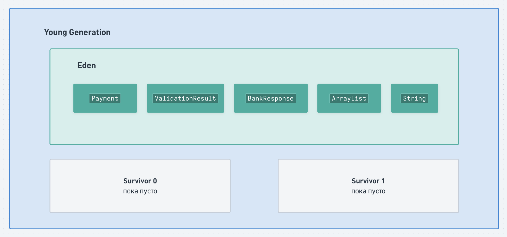

# Garbage Collection и утечки памяти

Представим сервис обработки платежей. На каждый запрос приложение создаёт много объектов:

```java
public PaymentResult process(PaymentRequest request) {
    Payment payment = createPayment(request);
    ValidationResult validation = validate(payment);
    BankResponse response = sendToBank(payment);

    return createResult(payment, response);
}
```

Для одного платежа появились: `PaymentRequest`, `Payment`, `ValidationResult`, `BankResponse`, `PaymentResult`. Часть этих объектов нужна только несколько миллисекунд: например, после завершения `process()` объект `ValidationResult` может больше нигде не использоваться.

Другие объекты живут значительно дольше. Например, приложение может хранить результаты платежей в кеше:

```java
cache.put(payment.getId(), result);
```

Пока `cache` содержит ссылку на `result`, этот объект остаётся нужен JVM.

Если все объекты Heap обрабатывать одинаково, сборщику мусора пришлось бы постоянно проверять весь Heap. Поэтому используется наблюдение:

> Большинство объектов обычно живет недолго (например, в рамках метода). Но если какой-то объект уже пережил несколько сборок мусора, с большой вероятностью он проживет ещё какое-то время.

На этой идее основана **generational garbage collection** — сборка мусора по поколениям.

***

## Young Generation и Old Generation

Упрощённо Heap можно представить так:

<figure><figcaption></figcaption></figure>

**Young Generation** предназначен для молодых объектов. Обычно новые объекты сначала создаются именно здесь.

**Old Generation** предназначен в основном для объектов, которые прожили достаточно долго и пережили несколько сборок мусора.

Такое деление позволяет JVM часто очищать относительно небольшую область с молодыми объектами, вместо того чтобы каждый раз обрабатывать весь Heap.

Классическая схема с непрерывными областями `Eden + S0 + S1 + Old` описывает устройство Serial и Parallel GC. У современного G1 такие поколения тоже существуют, но физически Heap устроен немного иначе — он разделён на небольшие регионы, которые в процессе работы могут менять роль — становиться Eden, Survivor или Old. К этому ещё вернёмся.

***

### Eden

Большинство объектов первоначально создаётся в **Eden**. Например:

```java
Payment payment = new Payment(...);
ValidationResult validation = new ValidationResult(...);
BankResponse response = new BankResponse(...);
```

Упрощённо получаем:

<figure><figcaption></figcaption></figure>

Приложение продолжает работать, объекты создаются, Eden постепенно заполняется. В какой-то момент JVM нужно освободить в Young Generation место для новых объектов. Происходит сборка молодого поколения — **Young GC** (часто можно встретить старое название **Minor GC**).

Но JVM не может просто удалить всё содержимое Eden: некоторые объекты всё ещё нужны программе.

Поэтому сначала нужно определить, какие объекты **живые**, а какие уже нет.

***

#### Что значит живой объект?

Допустим, во время обработки платежа Heap выглядит так:

```
Payment@1
ValidationResult@2
BankResponse@3
TemporaryBuffer@4
```

А Stack выполняющегося потока содержит:

```
payment  ─────────→ Payment@1
response ─────────→ BankResponse@3
```

`Payment@1` и `BankResponse@3` всё ещё **достижимы** из программы. А допустим, ссылок на:

```
ValidationResult@2
TemporaryBuffer@4
```

уже нигде нет. С точки зрения garbage collector:

```
Payment@1          → живой
BankResponse@3     → живой

ValidationResult@2 → мусор
TemporaryBuffer@4  → мусор
```

При следующей сборке память последних двух объектов можно использовать снова. И здесь нужны Survivor Spaces.

***

### Survivor Spaces

При Young GC JVM не просто оставляет живые объекты вперемешку с удалёнными.

Представим Eden:

```
Eden

[A] [B] [C] [D] [E]
     ↑       ↑
   живой   живой
```

`A`, `C` и `E` больше не нужны.

Можно было бы удалить их на месте:

```
[ ] [B] [ ] [D] [ ]
```

Но теперь память разбита на небольшие свободные участки. Формально есть три свободных ячейки, но при этом записать в Eden массив на 3 элемента мы не можем, потому что они идут не подряд.

Решение —  молодые живые объекты удобно **скопировать в отдельную область**, а Eden целиком считать свободным:

```
Eden
[ ] [ ] [ ] [ ] [ ]

Survivor
[B] [D]
```

Именно для этого существуют **Survivor Spaces**. В классической реализации их два — S0 и S1. Их роли меняются: сначала сборка идет в Eden и S0 и выжившие объекты переносятся в S1, потом сборка идет в Eden и S1, и выжившие переносятся в S0, и так далее.

***

Допустим, созданы три объекта:

```
Eden

Payment A
Payment B
Payment C
```

Через некоторое время `A` и `C` уже никому не нужны, но `B` всё ещё используется. Происходит Young GC.

`A` и `C` (мусор) не переносятся, просто занимаемая ими память помечается как свободная. `B` копируется в Survivor:

```
Eden
[пусто]

S0
[B, age = 1]

S1
[пусто]
```

У объекта появляется условный **возраст** — сколько Young GC он пережил. После этого приложение снова создаёт объекты:

```
Eden

[D] [E] [F]
```

Во время следующей Young GC выясняется:

```
B → всё ещё жив
D → умер
E → жив
F → умер
```

Теперь живые объекты копируются уже в другой Survivor Space:

```
S0
[пусто]

S1
[B, age = 2]
[E, age = 1]
```

На следующей сборке направления снова поменяются:

```
S1 → S0
```

Поэтому в классической схеме одновременно нужен один Survivor Space, содержащий пережившие прошлую сборку объекты, и второй, куда их можно скопировать во время текущей сборки. Один Survivor служит источником, второй — назначением следующего копирования.

***

### Зачем считать возраст объекта

Допустим, объект `PaymentSettings` пережил уже много Young GC:

```
GC №1 → жив
GC №2 → жив
GC №3 → жив
GC №4 → жив
...
```

Продолжать постоянно копировать его между Survivor Spaces бессмысленно. Скорее всего, это долгоживущий объект, и его можно проверять реже. Поэтому в какой-то момент происходит **promotion** или **tenuring** — объект переносится в Old Generation:

```
Young Generation

Eden
S0
S1

        │
        │ promotion
        ▼

Old Generation

PaymentSettings
```

Возраст, при котором это происходит, называется **tenuring threshold**. Конкретный порог может зависеть от сборщика и текущего состояния Heap; JVM умеет его адаптировать.

Кроме возраста существуют и другие причины promotion. Например, в Survivor могут не поместиться все пережившие сборку объекты.

***

### Old Generation

В **Old Generation** в основном оказываются объекты, которые прожили достаточно долго с точки зрения garbage collector — сервисы, репозитории, кеши и т. п.

Объекты в Old Generation тоже могут становиться ненужными. Например:

```java
cache.remove(paymentId);
```

Если после этого больше никаких ссылок на соответствующий объект нет, GC в дальнейшем сможет освободить и его.

Но Old Generation обычно значительно больше Young Generation и содержит больше живых объектов, поэтому его очистка потенциально дороже.

Именно поэтому идея поколений полезна: часто очищаем маленький Young, где ожидаем найти много мусора, и реже занимаемся долгоживущими объектами Old.

***

### Уточнение для G1

До этого Heap был описан упрощенно:

```
| Eden | S0 | S1 | Old |
```

Для понимания общего алгоритма это хорошая схема, но современный сборщик мусора G1 физически устроен иначе. Он разбивает Heap на множество одинаковых regions:

<figure><figcaption></figcaption></figure>

> То есть Young и Old у G1 остаются, но это уже не обязательно несколько больших непрерывных участков памяти.

***

## Что такое Garbage Collection

> **Garbage Collection** — автоматическое управление памятью Heap: JVM определяет, какие объекты больше не доступны программе, и освобождает занимаемую ими память для новых объектов.

Поэтому в Java не нужно вручную писать аналог `free(object)` как в языках с ручным управлением памятью типа C++.

Но GC должен решить главную задачу: как понять, что объект действительно больше никогда не понадобится программе?

***

### GC Roots

Почему нельзя просто считать ссылки? Рассмотрим два объекта:

```
A → B
↑   ↓
└───┘
```

То есть:

```
A → B
B → A
```

Они ссылаются друг на друга. Но допустим, из работающей программы до них добраться уже невозможно. Несмотря на взаимные ссылки, оба объекта являются мусором.

Поэтому HotSpot GC не работает по простому правилу "если на объект никто не ссылается — удалить". Он анализирует достижимость объектов от известных начальных точек.

Такие начальные точки называются **GC Roots**. К ним относятся, например, ссылки из Stack активных потоков и ссылки в `static` полях классов.

Здесь действительно лучше показать это кодом — так намного понятнее, откуда берётся **достижимость от GC Root**.

Представим сервис, который кеширует платежи:

```java
public class Application {

    // GC Root
    private static final PaymentService PAYMENT_SERVICE = new PaymentService();

    public static void main(String[] args) {
        Customer customer = new Customer(2L, "Анна");
        Payment payment = new Payment(1L, customer);

        PAYMENT_SERVICE.cache(payment);

        /*
         * Теперь существует цепочка ссылок:
         *
         * GC Root (PAYMENT_SERVICE) -> cache (допустим, HashMap) -> Payment@1 -> Customer@2
         *
         * И Payment, и Customer достижимы из Root -> Garbage Collector не может их удалить.
         */

        TemporaryA a = new TemporaryA();
        TemporaryB b = new TemporaryB();

        a.setB(b);
        b.setA(a);

        /*
         * TemporaryA a и TemporaryB b ссылаются только друг на друга.
         * Но локальные переменные a и b пока существуют -> есть ссылки
         * из Stack активного потока -> Garbage Collector не удалит объекты.
         */

        a = null;
        b = null;

        /*
         * Очистили ссылки в Stack, остались только ссылки в полях самих объектов:
         * TemporaryA <-> TemporaryB
         *
         * Они ссылаются друг на друга, но от GC Roots до них больше нет пути.
         *
         * Поэтому оба объекта считаются недостижимыми
         * и Garbage Collector может освободить их память.
         */
    }
}
```

В первой ситуации:

```java
PAYMENT_SERVICE
        ↓
      cache
        ↓
     Payment
        ↓
     Customer
```

цепочка начинается от объекта, который остаётся достижимым для JVM. Поэтому **все объекты ниже по цепочке тоже считаются живыми**.

Во второй после замены ссылок на `null`:

```
TemporaryA <-> TemporaryB
```

ссылки между объектами есть, но **пути от GC Root больше нет**. Этого достаточно, чтобы GC считал оба объекта мусором.

***

### Что GC делает с найденным мусором

Конкретный алгоритм зависит от garbage collector, но общую идею можно представить в несколько шагов.

Сначала определяется, какие объекты живы:

```
[A live] [B garbage] [C live] [D garbage]
```

Затем память мусора освобождается. Если просто помечать свободные места, получится:

```
[A] [ ] [C] [ ]
```

Это может приводить к **fragmentation — фрагментации памяти**: свободной памяти суммарно много, но она разделена на небольшие куски.

Поэтому сборщики могут дополнительно перемещать живые объекты:

```
до:
[A] [ ] [C] [ ]

после:
[A] [C] [        свободно        ]
```

Такой процесс называется **compaction — уплотнение**.

Другой подход, который мы уже увидели в Young Generation, — копирование живых объектов в новую область:

```
до:
[A] [garbage] [B] [garbage]

             ↓

новая область:
[A] [B]
```

Разные garbage collectors используют разные комбинации этих техник.

***

### Stop-The-World

Представим, что GC решил переместить `Payment@100` из одного места Heap в другое. Но одновременно поток приложения выполняет:

```java
payment.getAmount();
```

и работает со ссылками на этот объект. Может получиться так, что объект уже переместили, а ссылку поправить не успели, и по ссылке объект найти не смогли.

Согласовывать перенос объектов и одновременно позволять приложению произвольно что-то делать с этими объектами — сложно. Поэтому некоторые фазы сборки мусора выполняются в режиме **Stop-The-World (STW)**:

> JVM временно приостанавливает активные потоки, выполняет необходимую работу GC, а затем продолжает приложение.

Для пользователя сервиса это может проявляться как задержка ответа: если приложение обычно отвечает за 30 ms, а GC остановил приложение на 500 ms, какой-то запрос может неожиданно выполняться заметно дольше.

Поэтому при выборе GC важен не только объём освобождённой памяти, но и длительность пауз.

***

### Parallel и Concurrent

Эти слова часто встречаются в описании garbage collectors.

**Parallel** означает, что работу GC одновременно выполняют несколько потоков:

```
application остановлено

GC thread 1 ──┐
GC thread 2 ──┼── очищают Heap
GC thread 3 ──┘
```

Работа завершается быстрее, потому что используется несколько CPU.

**Concurrent** означает, что часть работы GC происходит одновременно с работой приложения:

```
Application threads - обрабатывают запросы пользователей
GC threads          - в то же время ведут сборку мусора
```

Это разные свойства. GC может быть одновременно parallel и concurrent — например, G1.

***

## Serial GC

**Serial GC** — самый простой из рассматриваемых сборщиков. Основную работу GC выполняет один поток: JVM останавливает потоки приложения, дает единственному потоку GC собрать мусор и потом дает приложению продолжить работу.

Serial GC не тратит ресурсы на координацию множества потоков, поэтому он относительно не затратный по ресурсам. Но если Heap большой, один поток может очищать его долго.

Serial хорошо подходит для небольших приложений, маленьких Heap и ограниченного количества CPU. В современном HotSpot его можно явно включить:

```bash
-XX:+UseSerialGC
```

***

## Parallel GC

Теперь представим большой Heap. Serial выполняет GC одним потоком:

```
GC thread 1
██████████████████████████████
```

Процессор при этом имеет, например, 8 ядер. Можно ускорить ту же работу, разделив её между несколькими GC потоками:

```
GC thread 1 ███████
GC thread 2 ███████
GC thread 3 ███████
GC thread 4 ███████
```

На этом основан **Parallel GC**. Он ориентирован прежде всего на то, чтобы приложение в сумме тратило как можно больше времени на полезную работу.

Он готов допустить сравнительно заметные отдельные паузы, если в итоге общий объём работы приложения будет высоким. Поэтому Parallel GC хорошо подходит, например, для обработки 50 000 000 записей, где важнее закончить задачу как можно быстрее, а отдельная пауза на несколько сотен миллисекунд не критична.

Включается:

```bash
-XX:+UseParallelGC
```

В отличие от Serial, сборкой занимаются несколько потоков, но работа приложения во время основных сборки мусора всё равно останавливается.

***

## G1 GC

Для серверного приложения часто есть другое требование. Например, API обрабатывает платежи. Общий объем выполненной работы важен, но нельзя регулярно получать огромные паузы — пользователь заметит такую задержку.

Именно здесь полезен **G1 — Garbage First Garbage Collector**. Он пытается делать относительно предсказуемые и короткие паузы для сборки мусора.

Как мы уже увидели, G1 делит Heap на регионы:

```
[E] [O] [ ] [S] [O] [E] [O] [ ]
```

Он выполняет часть дорогой работы **concurrently**, пока приложение продолжает выполняться.

Для Old Generation G1 анализирует регионы и может определить, например:

```
регион A → 90% мусора
регион B → 20% мусора
регион C → 70% мусора
```

Если нужно освободить память, выгоднее сначала обработать регион A, потому что освободится больше всего памяти.

Отсюда название G1 — **Garbage First, то есть сначала области, очистка которых наиболее выгодна.**

Включить G1 явно можно:

```bash
-XX:+UseG1GC
```

В современных серверных Java-приложениях этот сборщик включен по умолчанию.

У G1 тоже есть паузы, но значительная часть самых дорогих операций с Old Generation выполняется concurrently, то есть без остановки приложения, и очистка разбивается на небольшие части по регионам (не нужно ждать, пока очистим весь Heap).

***

## ZGC

Представим, что есть большая система, которая обрабатывает огромное количество запросов, Heap занимает десятки гигабайт, и даже редкая пауза в полсекунды неприемлема.

Здесь дефолтный G1 может уже не удовлетворять требованиям.

**ZGC — Z Garbage Collector** ориентирован прежде всего на **очень короткие паузы**.

Основную работу он как и G1 старается выполнять concurrently с работающим приложением, не останавливая его:

```
Application
████████████████████████████████

ZGC
    █████████████
             █████████████
```

Паузы всё равно существуют, но они очень короткие. Для современного ZGC Oracle указывает паузы меньше миллисекунды и подчёркивает, что их длительность практически не зависит от размера Heap.

Включается:

```bash
-XX:+UseZGC
```

За очень маленькие паузы приходится платить: concurrent GC постоянно выполняет дополнительную работу и активно использует ресурсы CPU.

***

## Какой GC используется по умолчанию

Для собеседования обычно достаточно ответа "до 8 Java включительно — Parallel, начиная с 9 — G1".

В реальности немного сложнее: **Java 8** смотрел на ресурсы устройства, на котором запускалась JVM, и по умолчанию выбирал Parallel GC. При ограниченных ресурсах мог использоваться Serial GC.

Начиная с **JDK 9** JMV также смотрит на ресурсы, но Parallel заменен на G1. При этом до JDK 27 HotSpot всё ещё мог автоматически выбрать Serial GC в ограниченной среде — например, при очень маленьком количестве CPU или памяти.

В **JDK 27** поведение изменилось: если разработчик сам не указал GC, HotSpot выбирает **G1 независимо от количества CPU и доступной памяти**.

***

## Что такое memory leak в Java

На первый взгляд кажется, что в Java утечек памяти быть не должно — ведь есть Garbage Collector, значит ненужные объекты он удалит.

Но вспомним правило GC:

> GC удаляет **недостижимые** объекты.

А теперь представим объект:

```
GC Root
   │
   ▼
cache
   │
   ▼
Payment@1
```

Для логики `Payment@1` может быть уже совершенно не нужен, но `cache` всё ещё хранит на него ссылку. С точки зрения JVM:

```
GC Root → cache → Payment@1
```

Объект достижим. Следовательно, GC не имеет права его удалить.

JVM не понимает бизнес-смысл программы. Она не знает, что платёж был обработан три месяца назад и больше никогда не понадобится (а если понадобится, он лежит в БД, откуда его быстро можно достать, нет смысла его постоянно держать в памяти приложения).

JMV знает только что до объекта существует путь от GC Root -> с ее точки зрения он еще нужен.

Отсюда определение:

> **Memory leak в Java** — ситуация, когда программа продолжает удерживать ссылки на объекты, которые логически уже не нужны, поэтому Garbage Collector не может освободить занимаемую ими память.

***

### Пример: бесконечно растущий `static Map`

Из примера выше:

```java
class PaymentHistory {

    private static final Map<Long, Payment> PAYMENTS = new HashMap<>();

    public static void cache(Payment payment) {
        PAYMENTS.put(payment.getId(), payment);
    }
}
```

Каждый платеж сохраняем и **никогда не очищаем кеш** — через день может накопиться 10 000 объектов, через неделю 500 000, через месяц 2 000 000 и т. д.

```
PaymentHistory class
      │
      ▼
static PAYMENTS
      │
      ▼
HashMap
 ├── Payment@1
 ├── Payment@2
 ├── Payment@3
 ├── ...
 └── Payment@2_000_000
```

Все объекты остаются достижимыми. GC может запускаться хоть каждую секунду:

```
GC → Payment@1 достижим
GC → Payment@2 достижим
GC → Payment@3 достижим
...
```

Удалить их невозможно. Это классическая Java memory leak.

Решением может быть, например, ограниченный cache — максимум 10 000 элементов, если нужно добавить новые, удаляем старые. Или по времени — удаляем запись спустя 30 минут. Конкретное решение зависит от бизнес-задачи.

***

Также ранее разбирали, почему ключи `HashMap` желательно делать неизменяемыми. Теперь появляется ещё одна причина.

Представим:

```java
class UserKey {

    private String email;

    // equals() и hashCode() используют email
}
```

Добавляем:

```java
UserKey key = new UserKey("a@mail.ru");
map.put(key, largeObject);
```

`HashMap` вычислила `hash("a@mail.ru")` и положила запись в определённый bucket. Теперь изменили:

```java
key.setEmail("b@mail.ru");
```

Получаем другой `hashCode()`. Пытаемся сделать:

```java
map.remove(key);
```

`HashMap` ищет bucket уже по новому hash. А запись физически осталась в bucket, выбранном по старому hash.

В результате удалить запись обычным способом уже не получится. Если `Map` постоянно получает такие записи и объекты большие, это тоже может привести к утечке памяти.&#x20;

***

## Как memory leak выглядит при диагностике

В будущем рассмотрим конкретные инструменты, но пока достаточно запомнить, что на графике для нормального приложения Heap часто выглядит примерно как **пила**:

```
Размер Heap
│      /│      /│      /│
│     / │     / │     / │
│    /  │    /  │    /  │
│___/   │___/   │___/   │
│
└────────────────────────── время
```

Приложение создаёт объекты — Heap растёт. GC освобождает мусор — Heap падает.

Если же есть утечка, часто начинает расти **нижняя граница**:

```
Размер Heap
│                /│
│           /│  / │
│      /│  / │_/  │
│ /│  / │_/       │
│/ │_/             │
└────────────────────── время
```

После GC каждый раз остаётся всё больше живых объектов, график напоминает ступеньки.

***

## Вопросы


#### Расскажите про устройство Heap: Young Generation (Eden, Survivor Spaces) и Old Generation.

**Heap** — общая для всех потоков область памяти, в которой размещаются объекты и массивы. Делится на Young и Old Generation, Young Generation в свою очередь делится на Eden, S0 и S1.

Объекты первоначально создаются в **Eden**. Когда Young Generation заполняется, происходит малая сборка мусора: недостижимые объекты (мусор) удаляются, а достижимые переносятся в **S0** или **S1**. Если объект переживает достаточно сборок, он переносится в Old Generation.

**Old Generation** предназначен в основном для долгоживущих объектов и очищается реже.

Физически расположение регионов зависит от сборщика. Например, у Serial и Parallel каждому поколению выделена непрерывная область памяти в heap, а у G1 Heap разделён на регионы: часть из них играет роль Eden, часть Survivor, часть Old, и поколения не обязаны быть непрерывными областями.



### Что такое сборка мусора? Кратко расскажите про основные типы сборщиков (Serial, Parallel, G1, ZGC). Какой используется умолчанию в каких версиях Java?

**Garbage Collection** — автоматическое управление памятью Heap. GC начинается от GC Roots — например, ссылок из Stack активных потоков или `static` полей классов. Далее определяются все достижимые из корней объекты. Недостижимые объекты считаются мусором, и их память можно переиспользовать.

Некоторые фазы GC являются Stop-The-World: потоки приложения временно останавливаются. Parallel означает, что работу GC одновременно выполняют несколько потоков; concurrent означает, что часть сборки мусора выполняется одновременно с приложением, без его остановки.

* **Serial GC** выполняет сборку в одним потоком и подходит прежде всего небольшим приложениям с ограниченными ресурсами.
* **Parallel GC** использует несколько потоков и ориентирован на большой объем работы ценой потенциально больших пауз.
* **G1** делит Heap на регионы и выполняет значительную часть работы concurrently. Это основной  сборщик в современных JVM.
* **ZGC** ориентирован на минимальные паузы даже при больших Heap и выполняет практически всю работу concurrently.

В Java 8 для большинства случаев использовался Parallel GC, если ресурсы системы ограничены — Serial.

Начиная с Java 9 вместо Parallel используется G1, но в ограниченных по ресурсам системых HotSpot все еще мог выбрать Serial GC.

Начиная с JDK 27 HotSpot выбирает G1 по умолчанию независимо от количества CPU и доступной памяти.



### Что такое утечка памяти в Java? Приведите примеры, когда могут возникнуть утечки.

**Memory leak** в Java возникает, когда приложение продолжает удерживать ссылки на объекты, которые ему больше не нужны. Такие объекты остаются достижимыми от GC Roots, поэтому Garbage Collector считает их живыми и не может освободить память.

Типичный пример — `static Map`, в которую постоянно добавляют объекты и никогда их не удаляют. Также проблема может возникнуть если у ключа `HashMap` разрешено менять поля, участвующие в `hashCode()` — запись невозможно нормально найти и удалить.

Нормальное потребление памяти выглядит на графике как **пила** — пока приложение работает, Heap растет, но после сборки мусора возвращается к прежним значениям. Утечка памяти на графике выглядит как **ступеньки** — после каждой сборки мусора остается все больше и больше живых объектов.

